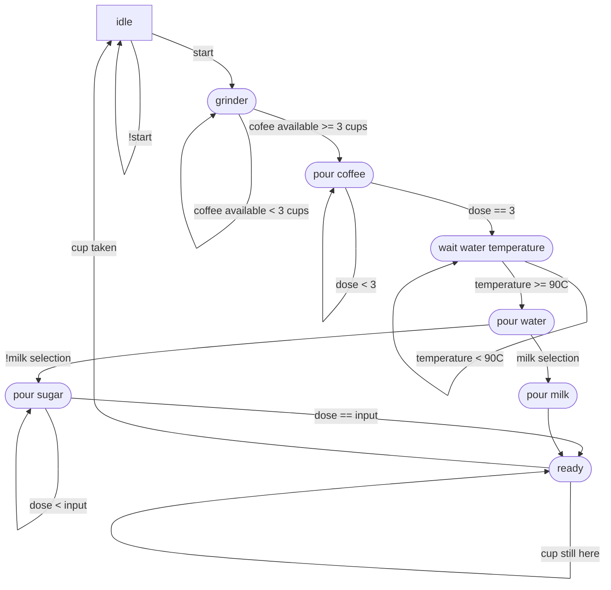

There is one recurring pattern when designing hardware with VHDL, it is
finite state machines.
Most people create a state machine in a natural way without even thinking about
its design.
Common usage involves a single process driven by a clock; however, this pattern
can be error prone and make the development tedious while keeping the code hard
to read and to maintain.
This article will introduce an alternative pattern with its own qualities and
shortcomings so that hardware developers can make informed choices about the
situations they encounter.

In order to highlight the differences between patterns, we'll define a common
goal to achieve with each one.
To keep things simple we'll design a simple coffee brewing machine.

The process will be the following:
- Wait for the start signal.
- Start heating water.
- If no ground coffee is remaining, launch the grind module and wait.
- Pour three doses of powder into a cup.
- Once the water is hot enough, pour the water into the cup.
- Add the selected number of sugar doses.
- Light up the "ready" signal until the user collects the cup.



```txt
// GetTitleFunc returns a func that can be used to transform a string to
// title case.
//
// The supported styles are
//
// - "Go" (strings.Title)
// - "AP" (see https://www.apstylebook.com/)
// - "Chicago" (see https://www.chicagomanualofstyle.org/home.html)
//
// If an unknown or empty style is provided, AP style is what you get.
func GetTitleFunc(style string) func(s string) string {
  switch strings.ToLower(style) {
  case "go":
    return strings.Title
  case "chicago":
    return transform.NewTitleConverter(transform.ChicagoStyle)
  default:
    return transform.NewTitleConverter(transform.APStyle)
  }
}

```


This state machine has the following inputs:

* `start` - start button
* `coffee_available` - coffee available
* `water_temperature` - water temperature
* `sugar_amount` - sugar amount
* `cup_present` - cup present/missing
* `reset` - reset
* `milk_selection` - milk selection

And the following outputs:

* `grinder_act_o` - Grinder activation
* `pour_coffee_o` - Pour coffee
* `pour_water_o` - Pour water
* `pour_sugar_o` - Pour sugar
* `pour_milk_o` - Pour milk
* `ready_light_o` - Ready light
* `heat_water_o` - Heat water

Note that the "Heat water" output will be used across several states, heating
water takes time and we do not want to make the user wait too much.
We will therefore begin the heating operation as soon as possible.
This not only serves the scenario in our example, it will also help
illustrate that an output state can be maintained over different steps.

## Natural approach

Let's first take a look at how a software developer would naturally approach
this problem.
I'd like to highlight the fact that this approach seems to be
closely related to the software development background, it might look a bit
less natural for people with an electronic background.

The first thing needed is a representation for every states.

```vhdl
type state_e is (IDLE,
                 GRINDER,
                 POUR_COFFEE,
                 WAIT_WATER_TEMP,
                 POUR_WATER,
                 POUR_MILK,
                 POUR_SUGAR,
                 READY,
                );
```

When representing the state of the machine, there's always some debate depending
on the targeted hardware.
Should we use "one hot", "binary" or "gray" encoding?
Most RTL synthesis tools have ways to control the state encoding of enumerated
state types, using attributes:

```vhdl
attribute enum_encoding : string;
attribute enum_encoding of state_e : type is "one-hot";
```

For the sake of clarity, we will be using plain enums in the following of this
post.
This does not mean you can't tune them to your liking.
The state will be stored in a signal.

```vhdl
signal state : state_e := IDLE;
```

We'll synchronize everything on a clock since it's a common use case for state
machines.

```vhdl
process(clk, rst) begin
    if rst = '0' then
        state <= IDLE;
    elsif rising_edge(clk) then
        -- State machine behavior
    end if;
end process;
```

Depending on the size of the code, the actual behavior of the state machine
might be hidden in several procedures instead of being written directly in the
process body.
Our example looks quite big, that's why we'll use this approach.

```vhdl
process(clock, reset) begin
    if reset = '0' then
        state <= IDLE;
    elsif rising_edge(clock) then
        case state is
            when IDLE            => idle_p;
            when GRINDER         => grinder_p;
            when POUR_COFFEE     => pour_coffee_p;
            when WAIT_WATER_TEMP => wait_water_temp_p;
            when POUR_WATER      => pour_water_p;
            when POUR_MILK       => pour_milk_p;
            when POUR_SUGAR      => pour_sugar_p;
            when READY           => ready_p;
        end case;
    end if;
end process;
```

We now need to define every procedure required by the state machine.
Since all those procedures are synchronized with the clock, we should not fear
any latch.
We simply have to change the `state` signal based on predefined conditions.

The following "Pour water" state implementation demonstrates how making a
decision for the next state can be done.

```vhdl
procedure pour_water_p is begin
    pour_water_o <= '1';
    if milk_selection then
        state <= POUR_MILK;
    else
        state <= POUR_SUGAR;
    end if;
end procedure;
```

As easy as it seems, there is a slight problem. We didn't turn off the water
pouring output signal.
This could be solved using two different ways:
- Introduce a new state to turn it off
- Turn it off in any next state

When designing hardware logic, time is often a key component: we cannot afford
to miss some clock cycles.
Some other component may rely on clock timings and isn't actively waiting for
us.
That's why the first solution is rarely used, it pollutes the namespace with
even more state name, is slower and reduces our timing accuracy.

We need to propagate the signal switch off to next states, which clearly makes
the code less maintainable.
When adding any new state, the developer should proceed with care to verify if
any signal shall be set and that none is missing.

Let's implement one of the next states to illustrate this solution.
```vhdl
procedure pour_sugar_p is begin
    pour_water_o <= '0';
    pour_sugar_o <= '1';
    if amount = sugar_amount then
        state <= READY;
        amount <= 0;
    end if;
end procedure;
```

Here, we loop until a condition is satisfied and then we exit the state.
A developer might be tempted to bypass the previous problem by switching the
`pour_sugar_o` signal off in a last iteration just like we did with the `amount`
counter.
This would look like this:

```vhdl
procedure pour_sugar_p is begin
    pour_water_o <= '0';
    if amount = sugar_amount then
        state <= READY;
        amount <= 0;
        pour_sugar_o <= '0';
    else
        pour_sugar_o <= '1';
    end if;
end procedure;
```

This method reduces the amount of work required in subsequent states, but it
ultimately produces even more work to maintain the code.
A developer should now track those early signal cut off in addition to
propagated ones.

Where should we go from here ?

## Multiple processes

Let's think about state machines, there is two kinds of information embedded in
each state:
- The action to achieve during the state
- The condition of exit to another state

In VHDL this could be decomposed as
- Input/Output
- Flow control

We need to find a way to decouple those two concepts into separate spaces in
order to reduce the code complexity.

We can achieve our goal by moving all output code to its own process.
This process will be driven directly by the current's state signal.

```vhdl
io: process(state) begin
    case state is
            when IDLE            =>
                ready_light_o <= '0';
            when GRINDER         =>
                grinder_act_o <= '1';
                heat_water_o  <= '1';
            when POUR_COFFEE     =>
                pour_coffee_o <= '1';
                grinder_act_o <= '0';
            when WAIT_WATER_TEMP =>
                pour_coffee_o <= '0';
            when POUR_WATER  =>
                pour_water_o  <= '1';
            when POUR_MILK       =>
                pour_milk_o   <= '1';
                pour_water_o  <= '0';
            when POUR_SUGAR      =>
                pour_sugar_o  <= '1';
                pour_water_o  <= '0';
            when READY           =>
                ready_light_o <= '1';
                pour_sugar_o  <= '0';
                pour_milk_o   <= '0';
        end case;
end process
```

The flow control can be achieved using a process which drives the state signal
directly.

## Latches

This code looks cleaner... even though it isn't.
The process is not driven by a clock signal edge but rather by a signal state.
This means all those fancy output signals will in fact generate latches.

Latches are inferred automatically by the language when a condition is not
directly driven by a clock signal and a branch misses a value assignation.

```vhdl
process (enable, data_in) begin
    if enable = '1' then
        data_out <= data_in;
    end if;
end process infer_latch;
```

As you may have heard, latches are bad for multiple reasons and add some stress
on the route planner.
But no latch is inferred if all combinations of input signals have an
assigned output value.
That's why we'll need to assign every output signal for every state value.
This makes the code longer, but it will also make it simpler.
As you have to specify every output signal for each state, you do not need to
bother about signal power-up or shut down, you simply need to know their output
for any given state.
Your synthesis tool will probably warn you if you miss a signal, but as the
pattern is the same for all states, you can probably spot any error easily.

```vhdl
io: process(state) begin
    case state is
            when IDLE            =>
                grinder_act_o <= '0';
                pour_coffee_o <= '0';
                pour_water_o  <= '0';
                pour_sugar_o  <= '0';
                pour_milk_o   <= '0';
                ready_light_o <= '0';
                heat_water_o  <= '0';
            when GRINDER         =>
                grinder_act_o <= '1';
                pour_coffee_o <= '0';
                pour_water_o  <= '0';
                pour_sugar_o  <= '0';
                pour_milk_o   <= '0';
                ready_light_o <= '0';
                heat_water_o  <= '1';
            when POUR_COFFEE     =>
                grinder_act_o <= '0';
                pour_coffee_o <= '1';
                pour_water_o  <= '0';
                pour_sugar_o  <= '0';
                pour_milk_o   <= '0';
                ready_light_o <= '0';
                heat_water_o  <= '1';
            -- [...]
        end case;
end process;
```

## Control flow

How should we proceed now for the control flow?

The flow control can be done as usual, matching the current state with a
decision on every clock tick.

```vhdl
flow: process(clk, rst, start) begin
    if rst = '1' then
        state <= IDLE;
    elsif rising_edge(clk) then
        case state is
            when IDLE =>
                if start = '1' then
                    state <= GRINDER;
                end if;
            when GRINDER =>
            -- [...]
        end case;
    end if;
end process;
```

You could keep it like this, but you might find other ways to achieve the same
result.
Some people like to have one process per signal in their architecture.
That's why you might find an alternate version of this pattern in some codebase.
The inability of older synthesis tools to handle big processes might be the
reason of this.
To do so, developers often introduce a new `next_state` signal. The flow
control process will drive this `next_state` signal instead of driving the
`state` signal directly.
This means the code requires an additional process to handle it.

```vhdl
sched : process(clk, rst) begin
    if rst = '1' then
        state <= IDLE;
    elsif rising_edge(clk) then
        state <= next_state;
    end if;
end process;
```

The flow process requires a slight modification with this variant to be
triggered on state change as well as drive the `next_state` signal instead.

```vhdl
flow : process(state, start) begin
    case state is
        when IDLE =>
            if start = '1' then
                next_state <= GRINDER;
            end if;
        when GRINDER =>
            -- [...]
end process;
```

You do need to pay attention to one thing though: the flow process sensitivity
list.
Modern versions of VHDL allow you to use the `all` wildcard keyword, but older
versions still need those explicitly.
If you forget any signal in there, the conditions around those signals will not
be updated correctly.
Let's imagine, I forgot the `start` signal in my sensitivity list, the
state machine would have never reached the `GRINDER` state.

All those modifications in this article lead us to decouple the signal output
control from the machine's flow control as well as the reset routine.
All those things no longer mix with each other.
Modifying the state machines does no longer require the developer to track a
signal's state in any previous or future step to make it work.

## Methodology

We've seen a way to split an existing state machine in multiple processes.
You may now wonder whether there is a methodology to achieve the same from
scratch.

Like any other state machine, the first step should be the definition of all
your states in an enumeration.
You then need to define your `state` signal which will represent the machine's
current state as well as your `next_state` signal in your architecture.
We can carry on with the `sched` process we've seen earlier, this process is
almost always the same. The sole variation depends on whether your component's
reset shall be done asynchronously or not.

Some conditions can be shared among multiple states.
If those conditions are complex, I'll usually create a new signal for the
condition whose value will be assigned in a combinatorial manner directly in the
architecture.
This practice merges similar code and produces shorter sensitivity lists.

Once those conditions are identified and their value assigned, the flow control
process can be made.
I usually create an empty process with a simple case statement in it.
The case statement should not have any `others` arm. The reason for this rule is
quite simple: if we miss any value from the enumeration, the
tools will be able to warn us.
Otherwise, any new state introduced in the future may silently fail by
implicitly matching this generic arm.
Once written, the flow control behavior can be added to each of these arms
safely.

Once the flow control has been achieved, the output signals can be set.
Once again, a case statement has to be made.
In each arm, I usually paste a `-` (don't care) or `x` (error) pattern
containing all signals that should be driven to avoid forgetting any.
The last step is then simply to replace these error values with their final
values for each of the states.

Adding any new state to the machine in the future will usually lead to the
following workflow:
- Change the enumeration
- Modify the exit condition of the new state's parents
- Update the sensitivity list
- Add an arm to the flow control process
- Add an arm to the output control process

## Single process state machine deprecation ?

If this article has somehow convinced you, do remember its pitfalls:
- Every output signal shall be listed to avoid latches
- The sensitivity list of every process shall be complete

You might experiment with this new way to build state machine and find it
easier.
It helps greatly to keep things clearly separated and allows a developer
to focus on one aspect of the state machine at a time, relieving its attention
span a bit.
Although, this is not the end for one-process state machines.
Multi-process state machines rely on the state signal to change their output,
therefore, the signal change can only happen after the state change.
This will not change much on real hardware, but as simulators cannot execute
multiple signal changes in parallel, this behavior will be visible on the
timeline.
This may make the signal debugging a little harder.

Is that all ? A little discomfort at delta cycle scale ?

Well, it may not.
On real hardware, multi-process state machine may use extra gates.
Furthermore, it may also take a negligible amount of extra time, this may become
relevant in highly time critical components.
If you really need those extra bits of time, then comparing the performances of
both designs will be required.
Single process state machine still has its usages and is therefore not
outdated.

## Going further

- Cummings, C. E. (1998) *State Machine Coding Styles for Synthesis*
- Cummings, C. E. (2002) *The Fundamentals of Efficient Synthesizable Finite State Machine Design using NC-Verilog and BuildGates*
- Cummings, C. E., & Chambers, H. (2019) *Finite State Machine Design & Synthesis using SystemVerilog*
- Gisselquist Technology, LLC [Clocks for Software Engineers](https://zipcpu.com/blog/2017/09/18/clocks-for-sw-engineers.html)
- Gisselquist Technology, LLC [Reasons why Synthesis might not match Simulation](https://zipcpu.com/blog/2018/08/04/sim-mismatch.html)